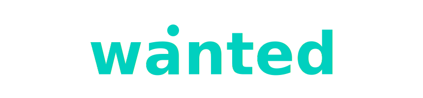

  

<h3 align="center">Специалисты, которые меняют игру</h3>

  Рекрутинговое агентство по подбору IT-специалистов 

  
  

---

## О нас

**Wanted** — рекрутинг в IT и Digital с 2017 года.  
Мы уважаем код, понимаем стек и рынок, работаем без лишней бюрократии.  

Здесь на GitHub мы ведём вакансии и делимся полезными материалами:  

- 💼 Репозитории `job-*` — открытые вакансии  
- 📝 Репозиторий `post-*` — статьи, заметки и разборы собеседований  

---

## Технологии, с которыми мы работаем

  <em>Включая, но не ограничиваясь:</em>

### Разработка

  
  
  
  
  
  
  
  
  
  
  
  
  
  
  
  
  
  
  

### Инфраструктура · Data · Security

  
  
  
  
  
  
  
  
  
  
  
  
  
  
  
  

### Тестирование

  
  
  
  

### Product · Менеджмент · Аналитика

  
  
  
  
  
  

---

## Контакты

  
  
  
  
  

  <em>© 2025 ООО «Вонтед»</em>

